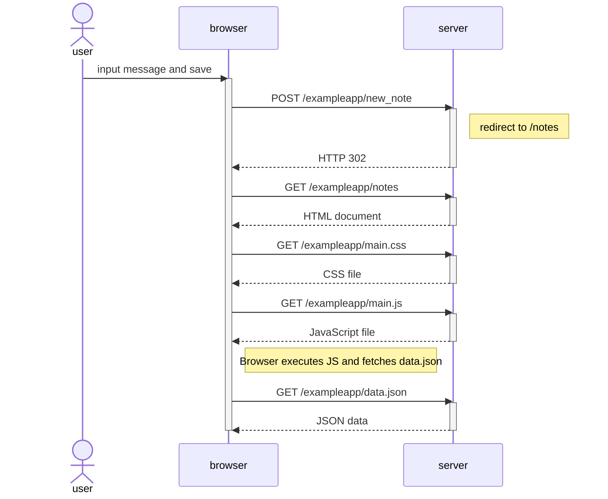

```mermaid
sequenceDiagram
    actor user
    participant browser
    participant server

    user->>browser: input message and save
    activate browser
    browser->>server: POST /exampleapp/new_note
    activate server
    note right of server: redirect to /notes
    server-->>browser: HTTP 302
    deactivate server

    browser->>server: GET /exampleapp/notes
    activate server
    server-->>browser: HTML document
    deactivate server

    browser->>server: GET /exampleapp/main.css
    activate server
    server-->>browser: CSS file
    deactivate server

    browser->>server: GET /exampleapp/main.js
    activate server
    server-->>browser: JavaScript file
    deactivate server

    note right of browser: Browser executes JS and fetches data.json
    browser->>server: GET /exampleapp/data.json
    activate server
    server-->>browser: JSON data
    deactivate server
    deactivate browser

```
